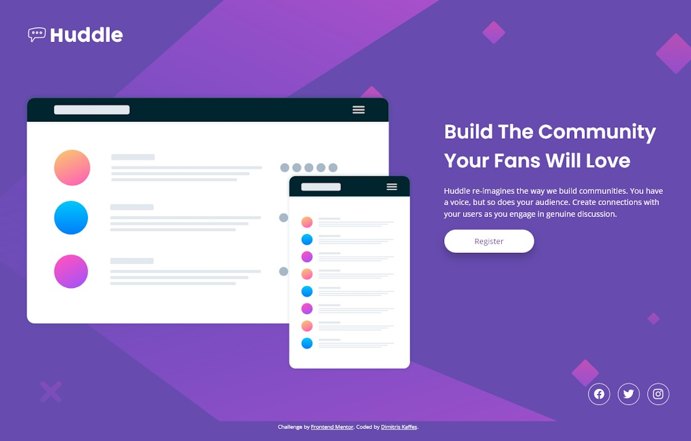

# Frontend Mentor - Huddle landing page with single introductory section solution

This is a solution from Dimitris Kaffes to the [Huddle landing page with single introductory section challenge on Frontend Mentor](https://www.frontendmentor.io/challenges/huddle-landing-page-with-a-single-introductory-section-B_2Wvxgi0). Frontend Mentor challenges help you improve your coding skills by building realistic projects.

## Table of contents

- [Overview](#overview)
  - [The challenge](#the-challenge)
  - [Screenshot](#screenshot)
  - [Links](#links)
- [My process](#my-process)
  - [Built with](#built-with)
  - [What I learned](#what-i-learned)
  - [Continued development](#continued-development)
  - [Useful resources](#useful-resources)
- [Author](#author)

## Overview

A landing page with `header`, `main` and `footer` sections.

Mobile-first design was implemented.

The layout changes to a two-column grid for the desktop version using a media query.

### The challenge

Users should be able to:

- View the optimal layout for the page depending on their device's screen size
- See hover states for all interactive elements on the page

### Screenshot

### Links

- Solution URL: [huddle-landing-page-single-introductory-section solution on Github](https://github.com/dkaffes/huddle-landing-page-single-introductory-section)
- Live Site URL: [huddle-landing-page-single-introductory-section live site](https://dkaffes.github.io/huddle-landing-page-single-introductory-section/)

## My process

A mobile-first approach was followed.

The HTML was structured using semantic elements.

The use of CSS Grid changed the layout to a two-column grid for the desktop version using a media query.

The social icons were aligned using Flexbox.

Custom properties were used for the colors.

For the social icons, the [Ionicons](https://ionicons.com/) font library was used.

CSS nesting and the `&` nesting selector were used for the `focus`, `hover` and `active` states of the button and the social links.

### Built with

- Semantic HTML5 markup
- CSS custom properties
- Flexbox
- CSS Grid
- Mobile-first workflow

### What I learned

- The basic structure of a small landing page.

- Embedding icons from a font library and styling them.

### Continued development

Further investigating the use of icons, font libraries and `.svg` files.

### Useful resources

- [Ionicons Usage](https://ionic.io/ionicons/usage) - This helped me embed the ionicons icons.
- [Using CSS nesting](https://developer.mozilla.org/en-US/docs/Web/CSS/CSS_nesting/Using_CSS_nesting) - This article explains how to use CSS nesting and the `&` nesting selector

## Author

- Frontend Mentor - [@dkaffes](https://www.frontendmentor.io/profile/dkaffes)
